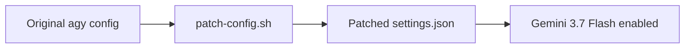

# Antigravity CLI 3.7 Flash Patch — Agent Guide

## Purpose

Patch script for Google Antigravity CLI (agy) to enable Gemini 3.7 Flash model in the CLI.

## Architecture



## Build

```bash
# Apply the patch
./patch-config.sh
```

## Verify

```bash
# Verify the patch applied
cat settings.json | grep -i flash
```

## Key Files

| File | Purpose |
|------|---------|
| (see directory listing) | |

## Notes

- Auto-generated AGENTS.md — update with project-specific details as needed
- Machine: t420 (Debian/Proxmox, 192.168.1.91)
- User: john
